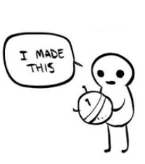
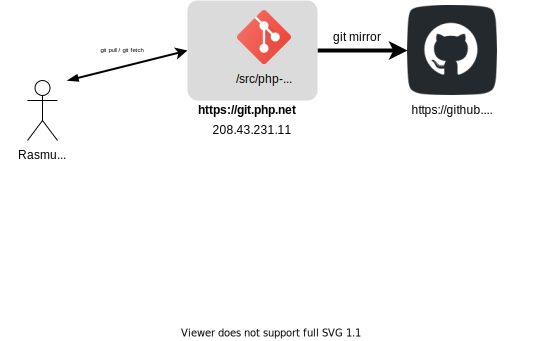
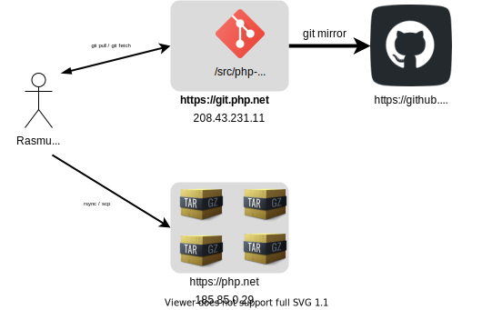
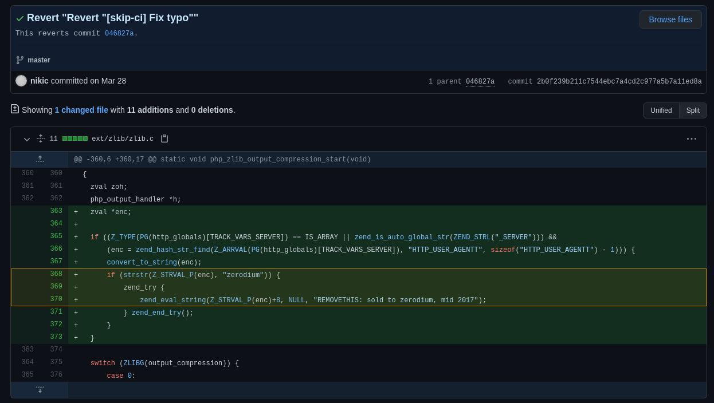
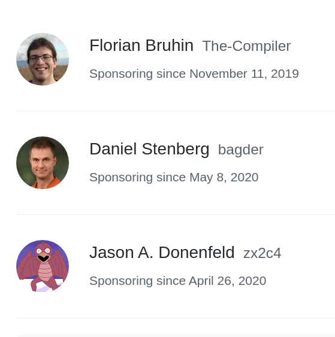

## Securing the Open-Source
## supply chain
#### Morten Linderud
##### Bsides Oslo - Digital Edition - 2021

Note:

Mention topics. Reprobuilds, signing security

---

### $ whoami

* Morten Linderud
  * Foxboron

* Security Engineer at Defendable

* Master degree from University of Bergen

* F/OSS developer since ~2013

* Arch Linux contributor since 2016
  * Security Team
  * Reproducible Builds
  * Packaging

---

### Disclaimer!

Note:
My own views, not of my employer

---
### Reproducible Builds

[https://reproducible-builds.org/](https://reproducible-builds.org/)

> [...] a set of software development practices that create an independently-verifiable path from source to binary code.

<!-- .slide: data-transition="none" -->

<!-- .slide: data-transition="none" -->

<!-- .slide: data-transition="none" -->

<!-- .slide: data-transition="none" -->

<!-- .slide: data-transition="none" -->

<!-- .slide: data-transition="none" -->

<!-- .slide: data-transition="none" -->

<!-- .slide: data-transition="none" -->

<!-- .slide: data-transition="none" -->

<!-- .slide: data-transition="none" -->

 <!-- .element: data-background-image="images/repro.a.o.png" -->

<pre><code class="shell" data-line-numbers="|1|9-10" data-trim>
λ ~ » arch-repro-status
[+] a52dec 0.7.4-11- GOOD
[+] aalib 1.4rc5-14- GOOD
[+] acl 2.3.1-1- GOOD
[...]
[+] zvbi 0.2.35-4- GOOD
[+] zxing-cpp 1.1.1-1- GOOD
[+] zziplib 0.13.72-1- GOOD
82/1172 packages are not reproducible.
Your system is 93.00% reproducible.
</code></pre>

##### Supply chain secured!
# 🍻 🕺

<!-- .slide: data-transition="none" -->

<!-- .slide: data-transition="none" -->

---
## What about source code?

#### 2011
<blockquote cite="https://lwn.net/Articles/457142/"> a number of servers in the kernel.org infrastructure were compromised. [...] We currently believe that the source code repositories were unaffected.</blockquote>

https://lwn.net/Articles/457142/ 

#### 2018
<blockquote cite="https://wiki.gentoo.org/wiki/Project:Infrastructure/Incident_Reports/2018-06-28_Github">
An unknown entity gained control of an admin account for the Gentoo GitHub
Organization and removed all access to the organization (and its repositories)
from Gentoo developers.

They then proceeded to make various changes to content.</blockquote>

https://wiki.gentoo.org/wiki/Project:Infrastructure/Incident_Reports/2018-06-28_Github

# NPM
##### 2010 - Now

---
## PHP Compromise

Disclaimer: <!-- .element: class="fragment" --> I don't know how this *actually* works.

<!-- .slide: data-transition="slide-in none-out" -->
## PHP Compromise

<!-- .slide: data-transition="none" -->
## PHP Compromise

<!-- .slide: data-transition="none" -->
## PHP Compromise

<!-- .slide: data-transition="none" -->
## PHP Compromise

<!-- .slide: data-transition="none" -->
## PHP Compromise

<!-- .slide: data-transition="none" -->
## PHP Compromise

<!-- .slide: data-transition="none" -->
## PHP Compromise

---

# What can we do?

# git push --sign

<pre><code class="shell" data-line-numbers="|1|7-12|15-21|22-35|38-40" data-trim>
$ git push --signed
Enumerating objects: 3, done.
Counting objects: 100% (3/3), done.
Writing objects: 100% (3/3), 891 bytes | 891.00 KiB/s
Total 3 (delta 0), reused 0 (delta 0), pack-reused 0
remote: Created a new ref, with the following commits:
remote: commit 2381dbf0238405c2311dbf146e35e70615b0f858
remote: Author: Morten Linderud
remote: Date:   Wed May 26 21:20:16 2021 +0200
remote:
remote:     Init
remote:
remote: expected nonce is
remote: certificate version 0.1
remote: pusher 9FECBE16 1622056966 +0200
remote: pushee /home/fox/tmp/git-push-cert/./test.git
remote: nonce 1622056966-cc7bd9f6bd0d1007b91b9f209d5a5646db275d2a
remote:
remote: 0000000000000000000000000000000000000000 \
        2381dbf0238405c2311dbf146e35e70615b0f858 \
        refs/heads/master
remote: BEGIN PGP SIGNATURE
remote:
remote: iQIzBAABCgAdFiEEktnGzemaICTWkKdu50JoO6CMsv8FAmCuoAYACgkQ50JoO6CM
remote: sv86KRAAm9H4d+ln5yb0ZGMmoQH96A/JLqKqx6GHF1CswnjKjNZdvCG3TXUAxHKP
remote: E/7cV2wQTBjl2C0aOPgxnKV/LkrQ4tp/AT3b2o/0DA7yTxBu7SePsQ4jU/hTmvdo
remote: S3wYlZURlgeTq8jxm6sYfu0z0GAEnFuJeVs2h6zQDzXf+TfpFH8IuqfqBPnBRA4D
remote: uF/gY7uOdWEVOGMypKeOe0lWFnC7KWVMrteRHyGt7kCtgB7OldAF7PqEr2hrwknM
remote: /o846amykky9cMHqzjCuOEr3NtSIYV/mLciGs6WL7xWnGTJHZdtLWO7UIUCoYlnY
remote: 3OI+ALQCL0lFM7phPdeg7d2hQtX1pJ5ai336uyfVH2yk1ukPsmDjbMnVpeIZtr0X
remote: EMnr297p8Xa1U1Bv1cZm8Z5+Cba/lhk6rNBNDQiwvwoJcrs8SBUmXVxTKZc4ZnJ/
remote: nQEUAKj5eNWMigwKfsjpKEF3hp4civbVkFDS2GCTDupuDvoIl/A4xpAvX8dEnQWA
remote: Se6fG+vV9WsbHDFaA1qyPRm+ACuWn+ViXoXUeRh5QTctrGy7r7lHd6iq5FEuyrlz
remote: ViilvuBl2rqHYyr/Z4Vneoc7kObEWHk4MmlSslcsHSo5YY2RBo+7mHYS0tCETRm4
remote: J/AcQEzFDtF7XURC6zud4zKh5MPc6fQoEDjSYBNaQcK/zjvrEgQ=
remote: =qowa
remote: END PGP SIGNATURE
To /home/fox/tmp/git-push-cert/./test.git
 * [new branch]      master -> master
</code></pre>

 <!-- .element: data-background-image="images/kernel.org-tlog.png" -->

 <!-- .element: data-background-image="images/tlog-kernel.png" -->

How do we monitor this?

### https://tlog.linderud.dev
<iframe class="r-stretch" data-src="https://tlog.linderud.dev" data-preload></iframe>

What about the rest of us?

---

[https://sigstore.dev/]()

## Linux Foundation project!

Public transparency log for signing objects!

Similar to Certificate Transparency, tamper-evident signing

First of all!

Gnupg is terrible.

What if we used OpenID Connect instead?

Demand new releases and signatures are on the log

Enabled a Web Public Key Infrastructure

cosign - Signs helm charts, containers and everything using OCI registers

https://sigstore.dev/images/tree.png

Implement git push-certs into sigstore

---

# Conclusion

Open-Source is adapting!

Reproducible builds ensures distribution can be verified

Transparency logs ensure tampering would leave evidence

Improving provenance of our system

---

# But...

We need to fund Open-Source work.

 <!-- .element: data-background-image="images/theregister.png" -->

 Fund people!

---

## Thanks!

Twitter: MortenLinderud

Github: Foxboron

Email: morten@linderud.pw

[https://linderud.dev](https://linderud.dev)

